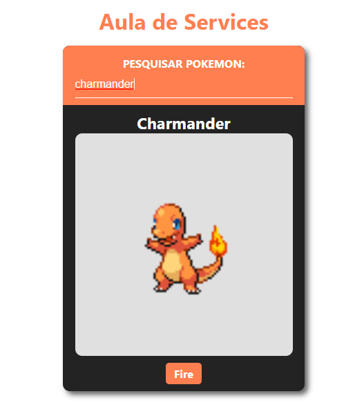

<h1 align="center"> Angular PokeApi </h1>

Projeto do Bootcamp Santander - Fullstack Java+Angular

  <a href="#-tecnologias">Tecnologias</a>&nbsp;&nbsp;&nbsp;|&nbsp;&nbsp;&nbsp;
  <a href="#-projeto">Projeto</a>&nbsp;&nbsp;&nbsp;|&nbsp;&nbsp;&nbsp;
  <a href="#-layout">Layout</a>&nbsp;&nbsp;&nbsp;|&nbsp;&nbsp;&nbsp;
  <a href="#memo-licença">Licença</a>

  

 

  

## 🚀 Tecnologias

Esse projeto foi desenvolvido com as seguintes tecnologias:

- Framework Angular(HTML, CSS e TypeScript)
- Git e Github

## 💻 Projeto

O projeto é o website Pokedex - barra para pesquisar pokemons e mostrar no card os detalhes deles - um estudo sobre services com Angular

## :memo: Licença